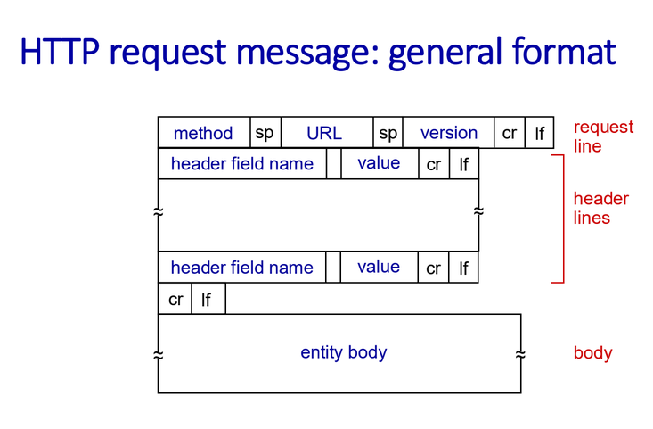
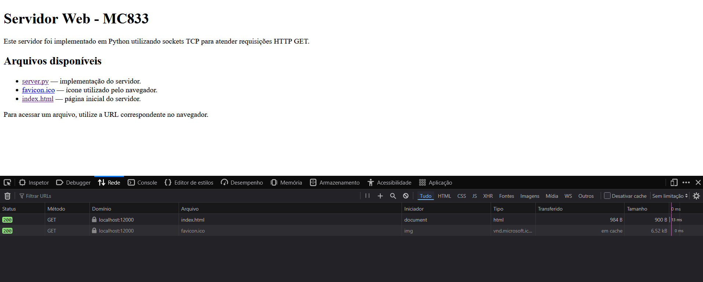

# Introdução

Este trabalho tem como objetivo o desenvolvimento de um servidor Web em Python capaz de receber e processar requisições HTTP GET utilizando sockets TCP. O servidor deve interpretar as requisições enviadas por clientes, localizar os arquivos solicitados no sistema de arquivos local e retornar respostas HTTP adequadas, incluindo respostas de sucesso (`200 OK`) e de recurso não encontrado (`404 Not Found`). Além disso, a aplicação deve ser capaz de atender múltiplos clientes simultaneamente por meio de um modelo concorrente baseado em threads.

A implementação foi desenvolvida a partir dos conceitos de programação em redes apresentados nas aulas, nos materiais disponibilizados e em pesquisas na internet. O servidor foi implementado em Python no arquivo `server.py`, tomando como base o modelo de servidor TCP nas instruções do laboratório e na implementação do livro texto. Para atender ao requisito de concorrência do projeto, esse modelo foi estendido com o uso de threads, de modo que cada conexão seja atendida independentemente enquanto a thread principal permanece disponível para aceitar novas conexões.

A organização do código priorizou legibilidade, modularidade e facilidade de compreensão. Para isso, as diferentes responsabilidades do servidor foram divididas em etapas bem definidas, como o recebimento dos dados pelo socket, a interpretação e validação da requisição, a identificação e leitura do recurso solicitado e a construção da resposta HTTP. Essa organização também busca facilitar a descrição e a análise de cada etapa ao longo deste relatório. Por se tratar de uma implementação de caráter didático, foram priorizados os requisitos propostos e os conceitos abordados na disciplina, sem a pretensão de reproduzir todos os mecanismos de robustez, segurança e otimização encontrados em servidores Web reais destinados a ambientes de produção. Por isso, não foram implementadas tratativas que vão além do escopo definido pelas orientações do laboratório.

Os testes apresentados neste trabalho serão realizados utilizando o navegador Firefox, versão 154.0, disponível nos computadores do laboratório. A especificação do navegador e de sua versão é relevante, pois diferenças na forma como cada navegador constrói e envia requisições HTTP podem influenciar o comportamento observado durante os testes.

# Hipóteses e decisões de projeto

Para delimitar o comportamento esperado do servidor e manter a implementação compatível com o escopo proposto para o projeto, foram adotadas algumas hipóteses e decisões de projeto.

O servidor considera apenas requisições que utilizem o protocolo **HTTP/1.1** e o método **GET**. Além disso, o programa foi desenvolvido considerando requisições HTTP com estrutura válida e previsível, como aquelas produzidas pelos navegadores utilizados durante os testes. Requisições malformadas, que utilizem outros métodos HTTP ou versões diferentes do protocolo não fazem parte do funcionamento esperado da aplicação. Alguns desses casos foram mapeados para respostas HTTP específicas, indicando que a requisição, a operação ou a versão do protocolo não é suportada.

Os recursos solicitados pelo cliente correspondem a arquivos disponíveis localmente no diretório de execução do servidor. Quando o cliente realiza uma requisição para a raiz (`/`), considera-se que o recurso solicitado é o arquivo `index.html`.

Cada conexão TCP é utilizada para o atendimento de uma requisição e encerrada após o envio da respectiva resposta HTTP. Dessa forma, não foi implementado o mecanismo de conexões persistentes do HTTP/1.1.

Considera-se também que a requisição HTTP enviada pelo cliente pode ser recebida integralmente utilizando o buffer definido pela aplicação, de **1024 bytes**. Assim, o servidor realiza uma única operação de recebimento para obter os dados necessários à interpretação da requisição. Essa simplificação é suficiente para os casos de teste previstos neste trabalho, mas não contempla situações em que a requisição seja maior que o buffer ou seja recebida de forma fragmentada em múltiplas operações de leitura do socket.

Os arquivos solicitados são lidos em modo binário, permitindo que o servidor envie tanto arquivos de texto quanto imagens e outros tipos de conteúdo. O tipo MIME do recurso é determinado a partir da extensão do arquivo e incluído no cabeçalho `Content-Type` da resposta. Caso o tipo do arquivo não possa ser identificado, é utilizado como fallback o tipo genérico `application/octet-stream`. Para os arquivos disponibilizados como parte do Servidor Web utilizado nos testes, espera-se que seus respectivos tipos MIME possam ser identificados normalmente.

Por se tratar de uma implementação de caráter didático, foram priorizados os requisitos definidos para o projeto e os conceitos abordados na disciplina. Dessa forma, não foram implementados mecanismos adicionais de segurança, robustez, otimização ou compatibilidade que ultrapassem o escopo estabelecido para o trabalho.

# Casos de uso

Os principais casos de uso do servidor estão resumidos na tabela a seguir:

| Caso de uso | Requisição do cliente | Comportamento esperado do servidor |
|---|---|---|
| Acesso à página inicial | `GET / HTTP/1.1` | Associar a URL `/` ao arquivo `index.html` e retornar `200 OK` com seu conteúdo. |
| Acesso a recurso existente | `GET /arquivo HTTP/1.1` | Localizar o arquivo solicitado no diretório local e retornar `200 OK` com seu conteúdo. |
| Acesso a recurso inexistente | `GET /arquivo_inexistente HTTP/1.1` | Identificar que o recurso não está disponível e retornar `404 Not Found`. |
| Requisição com versão HTTP não suportada | Requisição com versão diferente de `HTTP/1.1` | Retornar `505 HTTP Version Not Supported`. |
| Requisição com método não implementado | Requisição com método diferente de `GET` | Retornar `501 Not Implemented`. |
| Atendimento concorrente | Múltiplas conexões estabelecidas em intervalos próximos | Criar uma thread separada para cada conexão, mantendo a thread principal disponível para aceitar novos clientes. |

Esses casos representam os principais comportamentos previstos para a aplicação e servem como referência para a descrição da implementação e para os testes apresentados posteriormente.

# Descrição geral da aplicação

O funcionamento do servidor foi organizado de forma modular, com cada etapa do processamento sendo atribuída a uma função específica. De maneira geral, a aplicação inicia e configura um socket TCP, permanece aguardando conexões de clientes e, a cada nova conexão recebida, cria uma thread responsável por realizar o atendimento daquele cliente. A partir dessa thread, a mensagem recebida pela conexão é processada pelo servidor. Inicialmente, os dados são recebidos pelo socket e interpretados de acordo com a estrutura esperada para uma requisição HTTP. Em seguida, são realizadas as etapas de validação da mensagem, identificação do recurso solicitado, leitura do arquivo correspondente e construção e envio da resposta ao cliente.

A rotina `main()` é responsável pela inicialização do servidor e pelo controle do fluxo principal da aplicação. Seu funcionamento pode ser dividido em duas etapas: a inicialização e configuração do socket do servidor e o laço responsável por aceitar conexões e criar as threads de atendimento.

## Inicialização e configuração do servidor

A execução do servidor é iniciada pela criação de um socket TCP utilizando a família de endereços `AF_INET` e o tipo `SOCK_STREAM`. A primeira opção indica a utilização de endereços IPv4, enquanto a segunda especifica o uso de um socket orientado a conexão, correspondente ao protocolo TCP.

```python
server_socket = socket(AF_INET, SOCK_STREAM)
```

Em seguida, é configurada a opção `SO_REUSEADDR` no socket do servidor:

```python
server_socket.setsockopt(SOL_SOCKET, SO_REUSEADDR, 1)
```

Essa configuração permite que o endereço e a porta utilizados pelo servidor possam ser reutilizados após sua interrupção e reinicialização. Dessa forma, evita-se que uma nova execução do programa seja temporariamente impedida porque o sistema operacional ainda mantém informações associadas à execução anterior.

Após essa configuração, o socket é associado à porta definida pela constante `SERVER_PORT`:

```python
server_socket.bind(("", SERVER_PORT))
```

O endereço vazio passado ao método `bind()` faz com que o servidor aceite conexões destinadas a qualquer uma das interfaces de rede disponíveis na máquina. A porta utilizada é definida previamente pela aplicação, permitindo que os clientes saibam em qual porta devem estabelecer a conexão TCP.

Em seguida, o socket é colocado em modo de escuta por meio do método `listen()`:

```python
server_socket.listen(5)
```

A partir desse momento, o socket passa a estar preparado para receber solicitações de conexão. O valor `5` define o tamanho máximo da fila de conexões pendentes que podem aguardar até serem aceitas pela aplicação.

Por fim, uma mensagem é exibida no terminal para indicar que a inicialização foi concluída e que o servidor está pronto para receber conexões:

```python
print(f"Server listening on port {SERVER_PORT}")
```

## Laço de atendimento e criação de threads

Após a configuração do socket, o servidor entra em um laço de execução contínua. Esse laço representa a rotina principal de atendimento e permanece ativo enquanto o programa estiver em execução.

```python
while True:
    print("Ready to serve...")

    connection_socket, addr = server_socket.accept()
```

A chamada ao método `accept()` bloqueia a execução da thread principal até que um cliente estabeleça uma nova conexão TCP. Quando uma conexão é aceita, são obtidos dois valores: `connection_socket`, que representa um novo socket utilizado exclusivamente para a comunicação com aquele cliente, e `addr`, que contém as informações de endereço do cliente conectado.

O socket `server_socket` continua sendo utilizado somente para receber novas conexões. O atendimento da conexão recém-estabelecida é delegado ao novo socket retornado por `accept()`.

Para permitir o atendimento simultâneo de múltiplos clientes, uma nova thread é criada para cada conexão aceita:

```python
client_thread = Thread(
    target=handle_client,
    args=(connection_socket, addr)
)

client_thread.start()
```

A função `handle_client` é definida como alvo da thread e recebe como argumentos o socket da conexão e o endereço do cliente. A chamada ao método `start()` inicia a execução da nova thread, que passa a realizar de forma independente todo o processamento relacionado àquela conexão.

Dessa maneira, a thread principal não precisa aguardar o término do atendimento do cliente atual. Logo após iniciar a nova thread, ela retorna ao início do laço e executa novamente `accept()`, ficando disponível para receber outras conexões. Assim, diferentes clientes podem ser atendidos simultaneamente por threads distintas.

De forma simplificada, o fluxo executado pela rotina principal pode ser representado como:

```text
Inicialização do servidor
        |
        v
Criação e configuração do socket
        |
        v
     listen()
        |
        v
     accept()
        |
        +------> nova thread ---> handle_client()
        |
        v
     accept()
        |
        +------> nova thread ---> handle_client()
        |
       ...
```

O laço é executado dentro de um bloco `try`, permitindo que o servidor seja interrompido manualmente por meio de uma exceção `KeyboardInterrupt`. Nesse caso, a interrupção é informada no terminal e, independentemente da forma como o laço seja encerrado, o bloco `finally` garante o fechamento do socket principal do servidor.

```python
except KeyboardInterrupt:
    print("\nServer interrupted.")

finally:
    server_socket.close()
```

Essa organização mantém separadas as responsabilidades da aplicação: a thread principal fica responsável exclusivamente por aceitar novas conexões, enquanto as threads criadas ficam responsáveis pelo atendimento individual de cada cliente.

## Rotina de atendimento ao cliente

Após a criação de uma thread para uma nova conexão, a execução do atendimento é transferida para a função `handle_client()`. Essa função atua como ponto de entrada para todo o processamento associado a um cliente específico, recebendo como parâmetros o socket criado exclusivamente para aquela conexão e o endereço do cliente.

A rotina foi organizada como um **pipeline de processamento**, no qual a saída de uma etapa é utilizada como entrada da etapa seguinte. Dessa forma, `handle_client()` não concentra toda a lógica necessária para interpretar e responder à mensagem recebida. Em vez disso, ela coordena a execução de funções menores, cada uma responsável por uma etapa específica do atendimento.

O fluxo geral realizado pela função pode ser representado da seguinte forma:

```text
Conexão estabelecida
        |
        v
Recebimento da mensagem
   (receive_request)
        |
        v
Interpretação da mensagem
    (parse_request)
        |
        v
Processamento da solicitação
   (process_request)
        |
        v
Envio da resposta
      (sendall)
        |
        v
Fechamento da conexão
```

Inicialmente, `receive_request()` obtém os dados enviados pelo cliente por meio do socket. A mensagem recebida é então encaminhada para `parse_request()`, responsável por interpretar sua estrutura e extrair as informações necessárias para as etapas seguintes. O resultado dessa interpretação é passado para `process_request()`, que concentra o processamento da solicitação, incluindo sua validação, a identificação e leitura do recurso solicitado e a construção da resposta correspondente. Por fim, a resposta produzida é enviada ao cliente através do método `sendall()`.

Essa organização permite que `handle_client()` funcione principalmente como uma função de **coordenação do fluxo de atendimento**, enquanto as responsabilidades específicas permanecem isoladas em outras rotinas. Além de tornar o código mais legível, essa divisão facilita a análise individual de cada etapa e evita que detalhes de interpretação, acesso a arquivos e construção de respostas sejam concentrados em uma única função.

Todo esse fluxo é executado dentro da thread criada para a conexão correspondente. Assim, eventuais operações realizadas durante o atendimento de um cliente não impedem que a thread principal do servidor continue aceitando novas conexões. Ao término do processamento, independentemente de seu resultado, o socket associado ao cliente é fechado no bloco `finally`, encerrando a conexão utilizada por aquela thread.

### Recebimento da mensagem

A primeira etapa do pipeline de atendimento é realizada pela função `receive_request()`, responsável por receber os dados enviados pelo cliente através do socket associado à conexão.

```python
def receive_request(connection_socket):
    """
    Recebe os dados enviados pelo cliente e retorna a mensagem decodificada.

    A interpretação e validação da mensagem são  realizadas posteriormente.
    """
    return connection_socket.recv(BUFFER_SIZE).decode()
```

A função recebe como parâmetro `connection_socket`, que corresponde ao socket criado especificamente para a comunicação com o cliente atendido pela thread atual. Sobre esse socket é executado o método `recv()`, que realiza a leitura dos dados disponíveis na conexão.

O valor máximo recebido em uma única chamada é definido pela constante `BUFFER_SIZE`, configurada como `1024` bytes. Dessa forma, nesta implementação, considera-se que os dados necessários para o processamento da mensagem podem ser obtidos por meio de uma única operação de leitura com o tamanho do buffer. 

Nesta implementação, considera-se que todos os bytes necessários para a obtenção da *request line* podem ser recebidos em uma única operação de leitura. Nos testes realizados não houve nenhum erro relacionado à necessidade de realizar mais de uma operação de leitura.



Como o método `recv()` retorna os dados no formato de bytes, é utilizado o método `decode()` para convertê-los em uma string antes de encaminhá-los para a próxima etapa do pipeline.

É importante destacar que essa função possui somente a responsabilidade de **receber e decodificar os dados**. Nenhuma interpretação ou validação da estrutura da mensagem é realizada nesse momento. O conteúdo retornado é posteriormente encaminhado para a rotina `parse_request()`, responsável por analisar sua estrutura e extrair as informações utilizadas pelo servidor. Essa rotina e as seguintes serão responsáveis por lidar com e tratar a mensagem decodificada na rotina `receive_request()`

### Interpretação da mensagem

Após o recebimento e a decodificação dos dados enviados pelo cliente, a próxima etapa do pipeline é realizada pela função `parse_request()`. Sua responsabilidade é interpretar a mensagem recebida de acordo com a estrutura esperada para uma requisição HTTP e extrair apenas as informações necessárias para o restante do processamento.

```python
def parse_request(message):
    """
    Interpreta a mensagem recebida como uma requisição HTTP e extrai somente as informações necessárias ao servidor:
    método, URL e versão HTTP.
    """
    request_line = message.split("\r\n", 1)[0]
    fields = request_line.split()

    if len(fields) != 3:
        return None

    method, url, version = fields

    return {
        "method": method.upper(),
        "url": url,
        "version": version.upper()
    }
```

Como visto anteriormente, uma requisição HTTP possui uma linha inicial, chamada request line, que contém o método utilizado, o recurso solicitado e a versão do protocolo. Como essas são as únicas informações necessárias para o processamento realizado pelo servidor, a primeira operação da função consiste em isolar essa linha da mensagem completa recebida.

```python
request_line = message.split("\r\n", 1)[0]
```

A sequência `\r\n` representa o final de uma linha na mensagem HTTP. O parâmetro 1 utilizado em `split()` limita a divisão à primeira ocorrência, de forma que apenas a primeira linha da mensagem seja separada do restante dos cabeçalhos. Por exemplo, a partir de uma requisição como:

```text
GET /index.html HTTP/1.1
Host: 143.106.16.12:12000
User-Agent: Mozilla/5.0
...
```

A variável `request_line` passa a conter somente:

```text
GET /index.html HTTP/1.1
```

Em seguida, essa linha é dividida utilizando os espaços como separadores:
```python
fields = request_line.split()
```
Para uma requisição no formato esperado, são obtidos exatamente três campos:
```text
GET /index.html HTTP/1.1
 |        |        |
 |        |        +--> versão HTTP
 |        +-----------> URL do recurso
 +--------------------> método HTTP
 ```

 Quando a mensagem possui o formato esperado, os três valores são armazenados nas variáveis `method`, `url` e `version`. Em seguida, é construída uma estrutura do tipo dicionário contendo essas informações:
```python
 {
    "method": method.upper(),
    "url": url,
    "version": version.upper()
}
```

Gerando a partir de `GET /index.html HTTP/1.1`:
```python
{
    "method": "GET",
    "url": "/index.html",
    "version": "HTTP/1.1"
}
```

Os campos `method` e `version` são convertidos para letras maiúsculas para simplificar as comparações realizadas posteriormente. A URL é mantida sem alterações, pois será utilizada como caminho para identificação do recurso solicitado.

Esta etapa não realiza a validação do método ou da versão HTTP. Ela verifica apenas se a linha de requisição possui os três campos esperados. Caso essa estrutura mínima não seja encontrada, a função retorna `None`, indicando que a mensagem não pôde ser interpretada no formato esperado.


Essa representação é utilizada pelas etapas seguintes do pipeline, permitindo que o restante da aplicação trabalhe diretamente com os campos relevantes da requisição, sem precisar interpretar novamente a mensagem HTTP original.

### Processamento da requisição

Após a interpretação da mensagem, a estrutura produzida por `parse_request()` é encaminhada para a função `process_request()`. Essa função coordena as etapas necessárias para transformar a requisição interpretada em uma resposta HTTP completa.

```python
def process_request(request):
    """
    Executa o processamento da requisição.

    O pipeline é composto pelas etapas:
        1. Validação da requisição;
        2. Identificação do arquivo solicitado;
        3. Leitura do arquivo;
        4. Construção da resposta HTTP.
    """

    error_code = validate_request(request)

    if error_code is not None:
        return build_response(error_code)

    filename = get_filename(request)

    try:
        content = read_file(filename)

    except FileNotFoundError:
        return build_response(404)

    content_type, _ = mimetypes.guess_type(filename)

    if content_type is None:
        content_type = "application/octet-stream"

    return build_response(
        200,
        body=content,
        content_type=content_type
    )
```

A função `process_request()` atua principalmente como uma rotina de **coordenação do processamento**. Em vez de concentrar toda a lógica necessária para tratar a requisição em uma única função, cada operação é delegada a uma rotina específica.

Inicialmente, a requisição é encaminhada para `validate_request()`, que verifica se sua estrutura e seus campos são suportados pela implementação:

```python
error_code = validate_request(request)
```

Caso seja identificado algum erro, a função de validação retorna o código HTTP correspondente. Nesse caso, não é necessário continuar o processamento do recurso e a resposta é construída imediatamente:

```python
if error_code is not None:
    return build_response(error_code)
```

Quando a requisição é considerada válida, a próxima etapa consiste em identificar o arquivo correspondente à URL solicitada:

```python
filename = get_filename(request)
```

Em seguida, é realizada uma tentativa de leitura desse arquivo. Como a inexistência de um recurso solicitado é uma situação prevista no funcionamento do servidor, essa operação é executada dentro de um bloco `try`:

```python
try:
    content = read_file(filename)

except FileNotFoundError:
    return build_response(404)
```

Caso o arquivo não seja encontrado, a exceção `FileNotFoundError` é convertida em uma resposta HTTP `404 Not Found`. Quando a leitura ocorre com sucesso, a variável `content` passa a armazenar os bytes que serão utilizados como corpo da resposta.

Antes da construção da resposta de sucesso, o tipo MIME do recurso é determinado a partir de sua extensão utilizando o módulo `mimetypes`:

```python
content_type, _ = mimetypes.guess_type(filename)
```

Caso não seja possível identificar o tipo do arquivo, é utilizado o valor genérico `application/octet-stream`.

Por fim, o conteúdo do recurso, seu tipo MIME e o código de sucesso `200 OK` são encaminhados para `build_response()`, que constrói a mensagem HTTP completa que será posteriormente enviada ao cliente.

De maneira simplificada, o fluxo coordenado por `process_request()` pode ser representado como:

```text
Requisição interpretada
        |
        v
validate_request()
        |
        +---- erro ----> build_response(código de erro)
        |
        v
get_filename()
        |
        v
read_file()
    |       |
    |       +---- arquivo inexistente ----> 404 Not Found
    |
    v
identificação do tipo MIME
        |
        v
build_response(200, conteúdo)
```

Essa organização mantém `process_request()` responsável pelo fluxo geral da solicitação, enquanto as operações específicas de validação, identificação do arquivo, leitura e construção da resposta permanecem separadas em funções próprias.

#### Validação da requisição

A primeira etapa realizada por `process_request()` consiste em verificar se a requisição interpretada possui as características suportadas pelo servidor. Essa responsabilidade é delegada à função `validate_request()`:

```python
def validate_request(request):
    """
    Verifica se a requisição possui um formato e características
    suportadas pelo servidor.

    Retorna None caso a requisição seja válida ou o código HTTP
    correspondente ao erro encontrado.
    """
    if request is None:
        return 400

    if request["version"] != "HTTP/1.1":
        return 505

    if request["method"] != "GET":
        return 501

    return None
```

A função recebe a representação produzida anteriormente por `parse_request()` e verifica, inicialmente, se a mensagem pôde ser interpretada corretamente. Como `parse_request()` retorna `None` quando não encontra os três campos esperados na linha de requisição, esse caso é associado ao código `400 Bad Request`.

Em seguida, é verificada a versão do protocolo HTTP:

```python
if request["version"] != "HTTP/1.1":
    return 505
```

A implementação foi desenvolvida considerando requisições `HTTP/1.1`. Dessa forma, caso seja recebida uma versão diferente, é retornado o código `505 HTTP Version Not Supported`.

Por fim, é verificado o método solicitado:

```python
if request["method"] != "GET":
    return 501
```

Como o escopo do projeto prevê apenas o tratamento de requisições `GET`, outros métodos são associados à resposta `501 Not Implemented`.

Caso nenhuma das condições anteriores seja satisfeita, a função retorna `None`, indicando que nenhum erro foi encontrado e que o processamento pode continuar.

Em `process_request()`, esse resultado é utilizado da seguinte maneira:

```python
error_code = validate_request(request)

if error_code is not None:
    return build_response(error_code)
```

Assim, quando um erro é identificado, o restante do processamento é interrompido e a resposta HTTP correspondente é construída imediatamente.

#### Identificação do recurso solicitado

Após a validação da requisição, o próximo passo consiste em determinar qual arquivo local corresponde à URL solicitada pelo cliente. Essa operação é realizada pela função `get_filename()`:

```python
def get_filename(request):
    """
    Obtém o nome do arquivo solicitado a partir da URL
    presente na requisição.
    """
    url = request["url"]

    if url == "/":
        return "index.html"

    return url[1:]
```

A URL obtida durante a interpretação da mensagem contém uma barra `/` no início do caminho. Como os arquivos utilizados pela aplicação são acessados a partir do diretório de execução do servidor, essa barra inicial é removida antes da tentativa de abertura do arquivo.

Por exemplo:

```text
/index.html   -> index.html
/favicon.ico  -> favicon.ico
/teste.txt    -> teste.txt
```

Também foi definido um tratamento específico para a URL correspondente à raiz do servidor:

```python
if url == "/":
    return "index.html"
```

Dessa forma, quando o navegador realiza uma requisição como:

```text
GET / HTTP/1.1
```

o servidor considera que o recurso solicitado é o arquivo `index.html`.

O nome obtido pela função é então retornado para `process_request()`:

```python
filename = get_filename(request)
```

Essa separação mantém a interpretação da URL isolada da etapa responsável pelo acesso efetivo ao sistema de arquivos.

#### Leitura do arquivo

Após a identificação do nome do recurso, `process_request()` tenta realizar sua leitura utilizando a função `read_file()`:

```python
def read_file(filename):
    """
    Tenta abrir e ler o arquivo solicitado.

    O arquivo é aberto em modo binário para permitir o envio
    tanto de arquivos de texto quanto de imagens e outros
    tipos de conteúdo.
    """
    with open(filename, "rb") as file:
        return file.read()
```

O arquivo é aberto utilizando o modo `rb`, correspondente à leitura binária. Com isso, o conteúdo retornado pela função já se encontra no formato de bytes utilizado posteriormente pelo socket.

Essa abordagem permite utilizar a mesma rotina para diferentes tipos de recursos. Arquivos textuais, como `index.html` e `teste.txt`, e arquivos binários, como `favicon.ico`, são tratados da mesma maneira durante a leitura.

Em `process_request()`, a chamada é realizada dentro de um bloco `try`:

```python
try:
    content = read_file(filename)

except FileNotFoundError:
    return build_response(404)
```

Caso o arquivo exista, seu conteúdo é armazenado na variável `content`. Caso contrário, a função `open()` gera uma exceção `FileNotFoundError`, que é capturada por `process_request()` e transformada em uma resposta `404 Not Found`.

Dessa maneira, a inexistência de um recurso solicitado é tratada como uma situação prevista pelo servidor e não como um erro capaz de interromper sua execução.

#### Identificação do tipo do recurso

Quando o arquivo é encontrado e lido corretamente, o servidor determina o tipo de conteúdo que será informado na resposta HTTP.

Para isso, é utilizada a função `guess_type()` do módulo `mimetypes`:

```python
content_type, _ = mimetypes.guess_type(filename)
```

A identificação é realizada a partir do nome e da extensão do arquivo. Dessa forma, recursos diferentes podem resultar em valores distintos para o cabeçalho `Content-Type`, como:

```text
index.html   -> text/html
favicon.ico  -> image/vnd.microsoft.icon
teste.txt    -> text/plain
```

Caso o módulo não consiga identificar o tipo associado ao arquivo, é utilizado o tipo genérico `application/octet-stream`:

```python
if content_type is None:
    content_type = "application/octet-stream"
```

Esse valor permite indicar que o corpo da resposta contém uma sequência genérica de bytes quando não há um tipo MIME mais específico disponível.

Após essa etapa, `process_request()` possui todas as informações necessárias para produzir uma resposta de sucesso: o código HTTP, o conteúdo do arquivo e seu tipo MIME.

#### Construção da resposta HTTP

A construção das respostas enviadas ao cliente é centralizada na função `build_response()`:

```python
def build_response(status_code, body=b"", content_type="text/plain"):
    """
    Constrói a mensagem de resposta HTTP a ser enviada
    ao cliente.
    """
    status_message = STATUS_MESSAGES[status_code]

    header = (
        f"HTTP/1.1 {status_code} {status_message}\r\n"
        f"Content-Length: {len(body)}\r\n"
        f"Content-Type: {content_type}\r\n"
        "Connection: close\r\n"
        "\r\n"
    )

    return header.encode() + body
```

A função recebe o código de status HTTP e, opcionalmente, o corpo da mensagem e o tipo do conteúdo. Para obter a descrição correspondente ao código, é utilizado o dicionário `STATUS_MESSAGES`.

Por exemplo:

```python
STATUS_MESSAGES = {
    200: "OK",
    400: "Bad Request",
    404: "Not Found",
    501: "Not Implemented",
    505: "HTTP Version Not Supported"
}
```

Com essas informações, é construída inicialmente a linha de status da resposta. Para uma requisição atendida com sucesso, por exemplo, a primeira linha será:

```text
HTTP/1.1 200 OK
```

Em seguida, são adicionados os cabeçalhos utilizados pela implementação. `Content-Length` informa o tamanho do corpo da mensagem em bytes, enquanto `Content-Type` apresenta o tipo MIME determinado anteriormente.

O cabeçalho:

```text
Connection: close
```

indica que a conexão será encerrada após o envio da resposta, de acordo com a decisão adotada nesta implementação de utilizar uma requisição por conexão.

A sequência:

```python
"\r\n"
```

adicionada após os cabeçalhos produz a linha vazia que separa o cabeçalho HTTP do corpo da resposta.

Como o cabeçalho é construído inicialmente como uma string, ele é convertido para bytes através de `encode()` antes de ser concatenado ao corpo:

```python
return header.encode() + body
```

Dessa forma, a função retorna uma única sequência de bytes contendo toda a resposta HTTP, já preparada para ser enviada pelo socket.

No caso em que o recurso foi encontrado com sucesso, `process_request()` chama essa função da seguinte forma:

```python
return build_response(
    200,
    body=content,
    content_type=content_type
)
```

Assim, o resultado final de `process_request()` é sempre uma mensagem HTTP completa, seja ela uma resposta de sucesso ou uma resposta correspondente a algum erro identificado durante o processamento.

# Estruturas de dados

A implementação não necessita de estruturas de dados complexas, uma vez que o servidor mantém apenas as informações necessárias para o processamento de cada requisição. Também não foram criadas estruturas completas para representar mensagens HTTP, como classes ou objetos contendo todos os campos de uma requisição ou resposta. Em vez disso, apenas os dados utilizados pela aplicação são extraídos e armazenados durante o processamento.

Além disso, as informações associadas a cada cliente permanecem locais à thread responsável pelo seu atendimento. Dessa forma, não foi necessário manter uma estrutura global contendo conexões ou requisições em processamento.

As principais estruturas utilizadas pela aplicação são descritas a seguir.

## Representação da requisição

Após o recebimento da mensagem HTTP, a função `parse_request()` extrai apenas os três campos da *request line* utilizados pelo servidor: o método HTTP, a URL e a versão do protocolo.

Essas informações são armazenadas em um dicionário Python:

```python
{
    "method": method.upper(),
    "url": url,
    "version": version.upper()
}
```

Por exemplo, para a linha:

```text
GET /index.html HTTP/1.1
```

é produzida a seguinte estrutura:

```python
{
    "method": "GET",
    "url": "/index.html",
    "version": "HTTP/1.1"
}
```

Os demais cabeçalhos presentes na mensagem HTTP não são armazenados, pois não são necessários para os casos de uso previstos nesta implementação. Dessa forma, em vez de manter uma representação completa da requisição recebida, o programa utiliza uma estrutura reduzida contendo somente os campos necessários para as etapas de validação e localização do recurso.

## Mapeamento dos códigos de status HTTP

Para associar os códigos numéricos das respostas HTTP às suas respectivas descrições, é utilizado o dicionário `STATUS_MESSAGES`:

```python
STATUS_MESSAGES = {
    200: "OK",
    400: "Bad Request",
    404: "Not Found",
    501: "Not Implemented",
    505: "HTTP Version Not Supported"
}
```

Nesse dicionário, cada chave corresponde a um código de status HTTP e seu valor contém a descrição utilizada na linha inicial da resposta.

Por exemplo, ao construir uma resposta com o código `404`, a expressão:

```python
STATUS_MESSAGES[404]
```

retorna:

```text
Not Found
```

permitindo a construção da linha:

```text
HTTP/1.1 404 Not Found
```

O uso desse dicionário centraliza as mensagens correspondentes aos códigos suportados pelo servidor e evita a repetição dessas informações ao longo do código.

## Conteúdo dos arquivos e resposta HTTP

Os arquivos solicitados pelo cliente são lidos em modo binário. Dessa forma, seu conteúdo é armazenado como um objeto do tipo `bytes`:

```python
with open(filename, "rb") as file:
    return file.read()
```

O uso de `bytes` permite que a mesma representação seja utilizada para arquivos de texto e arquivos binários, como o `favicon.ico`.

A resposta HTTP também não é armazenada em uma estrutura própria. Seus cabeçalhos são inicialmente construídos como uma `string`:

```python
header = (
    f"HTTP/1.1 {status_code} {status_message}\r\n"
    f"Content-Length: {len(body)}\r\n"
    f"Content-Type: {content_type}\r\n"
    "Connection: close\r\n"
    "\r\n"
)
```

Em seguida, o cabeçalho é convertido para `bytes` e concatenado diretamente ao corpo da resposta:

```python
return header.encode() + body
```

Assim, o resultado de `build_response()` é uma única sequência de bytes contendo a mensagem HTTP completa, já preparada para ser enviada através do socket por meio de `sendall()`.

## Informações das conexões

Ao aceitar uma nova conexão, o método `accept()` fornece o socket utilizado para comunicação com o cliente e seu endereço:

```python
connection_socket, addr = server_socket.accept()
```

O objeto `connection_socket` representa a conexão TCP específica daquele cliente, enquanto `addr` contém as informações de endereço fornecidas pela biblioteca de sockets.

Esses valores são encaminhados diretamente para a thread responsável pelo atendimento:

```python
client_thread = Thread(
    target=handle_client,
    args=(connection_socket, addr)
)
```

Não é mantida uma lista global de clientes ou de threads. Cada conexão é tratada de forma independente e, ao final de seu processamento, o socket correspondente é fechado. Essa escolha mantém simples o gerenciamento dos dados associados aos clientes e evita a necessidade de sincronização sobre estruturas compartilhadas.

# Testes e execução

Os testes da aplicação foram realizados no laboratório IC-300, utilizando duas máquinas distintas da rede do Instituto de Computação. O servidor foi executado na máquina `beatles`, com endereço IP `143.106.16.12`, enquanto o cliente foi executado na máquina `sabbath`, com endereço IP `143.106.16.13`.

Na máquina servidor, a aplicação foi iniciada por meio do comando:

```bash
python3 server.py
```

A partir da máquina cliente, o servidor foi acessado através do navegador Firefox 154.0, utilizando o endereço IP da máquina servidor e a porta definida pela aplicação. O acompanhamento das requisições realizadas pelo navegador foi feito por meio das Ferramentas do Desenvolvedor, na aba Rede (Network), que permite visualizar as requisições HTTP enviadas pelo cliente e as respostas recebidas do servidor.

A figura abaixo apresenta um exemplo desse monitoramento durante a execução dos testes, exibindo as requisições realizadas para os recursos `index.html` e `favicon.ico`.



Durante o acesso à página inicial do servidor, o navegador realizou uma requisição semelhante à seguinte:

```text
GET / HTTP/1.1
Host: 143.106.16.12:12000
User-Agent: Mozilla/5.0 (X11; Linux x86_64; rv:154.0) Gecko/20100101 Firefox/154.0
Accept: text/html,application/xhtml+xml,application/xml;q=0.9,*/*;q=0.8
Accept-Language: en-US,en;q=0.9
Accept-Encoding: gzip, deflate
Connection: keep-alive
Upgrade-Insecure-Requests: 1
Priority: u=0, i
```

Esse exemplo permite observar a estrutura da mensagem recebida pelo servidor. Apesar de diversos cabeçalhos serem enviados pelo navegador, a implementação utiliza apenas as informações presentes na primeira linha da requisição: o método HTTP, a URL solicitada e a versão do protocolo. Nesse caso, esses valores correspondem, respectivamente, a GET, / e HTTP/1.1.

Como definido nas decisões de projeto, uma requisição para a raiz `/` é associada ao arquivo `index.html`. Após a interpretação da mensagem, o servidor identifica o recurso solicitado, realiza sua leitura e constrói a resposta HTTP correspondente.

```text
HTTP/1.1 200 OK
Content-Length: 900
Content-Type: text/html
Connection: close

<!DOCTYPE html>
<html lang="pt-BR">
...
```

A resposta confirma que o arquivo `index.html` foi localizado corretamente e enviado ao navegador. Os campos `Content-Length` e `Content-Type` descrevem, respectivamente, o tamanho do corpo da resposta e o tipo do recurso retornado.

Além da requisição para a página principal, durante os testes foi observado que o navegador Firefox realizou automaticamente uma requisição para o recurso `favicon.ico`. Como essa requisição corresponde a um recurso distinto da página principal, ela também é tratada de forma independente pelo servidor, podendo ser processada em paralelo a outras conexões. A requisição observada foi:

```text
GET /favicon.ico HTTP/1.1
Host: 143.106.16.12:12000
User-Agent: Mozilla/5.0 (X11; Linux x86_64; rv:154.0) Gecko/20100101 Firefox/154.0
Accept: image/avif,image/webp,image/png,image/svg+xml,image/*;q=0.8,*/*;q=0.5
Accept-Language: en-US,en;q=0.9
Accept-Encoding: gzip, deflate
Connection: keep-alive
Referer: http://143.106.16.12:12000/
Priority: u=6
```

Assim como na requisição anterior, apenas a primeira linha é necessária para o processamento realizado pela aplicação. Nesse caso, o método identificado é `GET`, o recurso solicitado é `/favicon.ico` e a versão utilizada é `HTTP/1.1`. Como o arquivo está presente no diretório do servidor, ele é lido em modo binário e retornado ao cliente com uma resposta `200 OK` e o tipo MIME correspondente.


# Conclusão

O desenvolvimento deste projeto permitiu aplicar, de forma prática, os conceitos de redes aprendidos na matéria MC832, entendo melhor como funciona um protocolo de aplicação a partir das especificidades do Procolo HTTP. Além disso, também foi possível entender de forma prática como a camada de aplicação utiliza o conceito de sockets TCP para abstrair as camadas inferiores do modelo OSI.


A implementação também atende ao requisito de concorrência através da criação de uma thread separada para cada conexão aceita pelo servidor. Dessa forma, a thread principal permanece disponível para receber novas conexões enquanto os clientes já conectados são atendidos independentemente. Esse modelo permite que diferentes requisições sejam processadas de forma concorrente e corresponde ao comportamento solicitado para o servidor.

A partir do modelo de implementação modular, foi possível entender cada etapa do processamento de uma mensagem do Cliente para o Servidor e o protocolo em mínimos detalhes, bem como também entender melhor toda a parte de comunicação de processos em rede. Também foi possível entender detalhes de implementação do navegador, como o carregamento do ícone da página. Os testes realizados através de um navegador em uma máquina distinta daquela em que o servidor foi executado permitiram observar diretamente as requisições e respostas HTTP trocadas entre cliente e servidor. O uso das ferramentas de desenvolvedor do navegador também possibilitou acompanhar os recursos solicitados e verificar o comportamento da aplicação durante sua execução, atendendo à orientação de validar o programa utilizando cliente e servidor em computadores diferentes.

Por se tratar de uma implementação de caráter didático, algumas simplificações foram adotadas. Entre elas, considera-se que os dados necessários para a interpretação da requisição podem ser obtidos em uma única chamada a `recv()`, apenas requisições `GET` utilizando `HTTP/1.1` são tratadas como válidas, e cada conexão é encerrada após o envio de uma única resposta. Também não foram implementados mecanismos adicionais de segurança, otimização ou compatibilidade presentes em servidores Web destinados a ambientes de produção.

Ainda assim, dentro do escopo proposto, o projeto permitiu compreender na prática a relação entre a aplicação HTTP e a interface do serviço de transporte fornecido pelo TCP, o funcionamento dos sockets no estabelecimento da comunicação cliente-servidor e a utilização de threads como mecanismo de concorrência. Dessa forma, os objetivos definidos para o projeto foram alcançados por meio de uma implementação simples, modular e compatível com os requisitos apresentados.